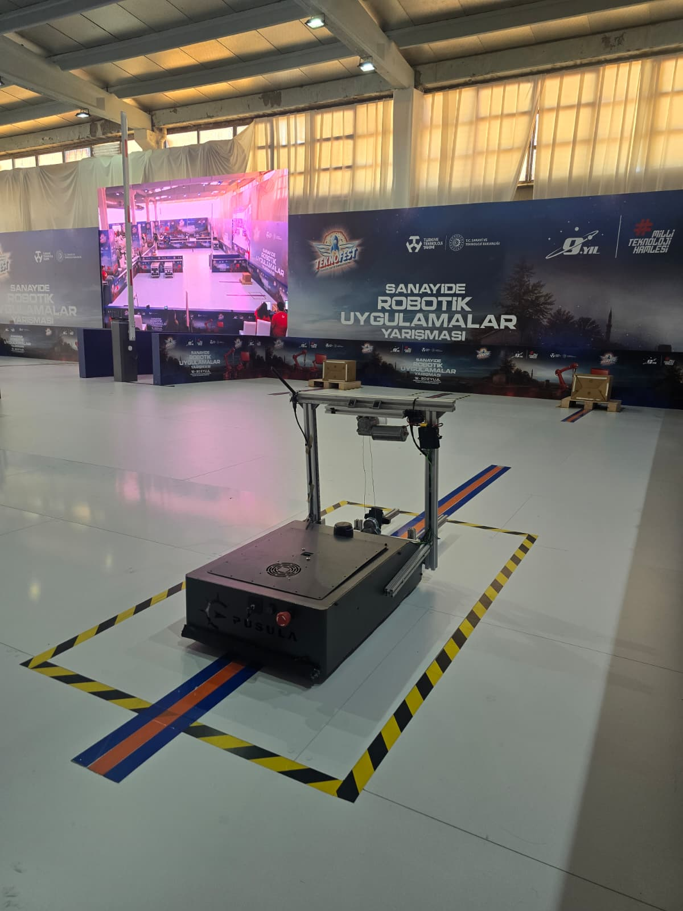
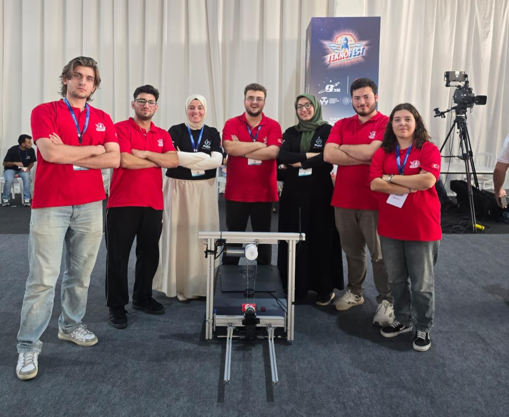

# SIRIUS AMR

SIRIUS, PUSULA takımı olarak TEKNOFEST 2026 Sanayide Robotik Uygulamalar Yarışması için geliştirdiğimiz otonom mobil forklift projesidir. Depo ve fabrika ortamlarında yük taşımak üzere tasarlanan araçla 30 finalist takım arasından **Türkiye 6'ncısı** olduk.

## Yarışma

SIRIUS; haritalama, fabrika otomasyon sistemiyle haberleşme, otonom navigasyon, engel algılama, çizgi takibiyle hassas yanaşma ve yük taşıma görevlerini gerçekleştirdi.

## Robot

| Bileşen | Açıklama |
| --- | --- |
| Ana bilgisayar | Jetson Nano 4 GB |
| Robotik altyapı | ROS 2 Humble, Nav2 ve SLAM Toolbox |
| Algılama | LiDAR, kamera, IMU ve tekerlek enkoderleri |
| Alt seviye kontrol | Arduino Mega 2560 ve ESP32 |
| Güç | 8S2P LiFePO4 batarya paketi ve BMS |
| Yük sistemi | DC motorlu kaldırma mekanizması |

## Yazılım

Robot, LiDAR ile oluşturulan harita üzerinde konumunu belirleyerek verilen hedefe giden rotayı planlıyor ve yol üzerindeki engelleri algılıyor. Yük noktalarında kamera ile QR kod ve çizgi takibi yaparak hassas yanaşma gerçekleştiriyor.

Web arayüzünün frontend tarafında HTML, CSS ve JavaScript; backend tarafında Python ve Flask kullanıldı. Harita, görev ve araç durumları ROSBridge WebSocket üzerinden arayüzde takip edilebiliyor.

## Projedeki Katkım

Yazılım ekibinde PLC/FMS haberleşmesi, sensör ve araç durumlarının yazılım sistemine aktarılması ve web kontrol arayüzü üzerinde çalıştım. Fabrika otomasyon sisteminden gelen görevlerin alınması, ROS 2 tarafına aktarılması ve görev durumunun geri bildirilmesi süreçlerinde görev aldım.

## Video

[Yarışma videosunu izlemek için tıklayın](assets/videos/sirius-demo.mp4)

## Takım

PUSULA, Bursa Teknik Üniversitesi.

| Rol | Ekip üyeleri |
| --- | --- |
| Takım kaptanı | Mehmet Furkan Ketme |
| Yazılım | Furkan Karslı, Elif Beycan, Aslıhan Okumuş, Sude Çakmak |
| Elektronik | Yusuf Düzenli, Netice Arsan |
| Mekanik | Hasan Eren Yazıcı, Oğuzhan Dursun |
| Danışman | Oğuz Mısır |

## Not

Bu depo, SIRIUS projesini ve projedeki kişisel katkılarımı tanıtmak amacıyla hazırlanmıştır. Kaynak kodlar takımın ortak çalışma alanında tutulduğu için burada paylaşılmamaktadır.

