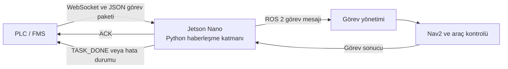
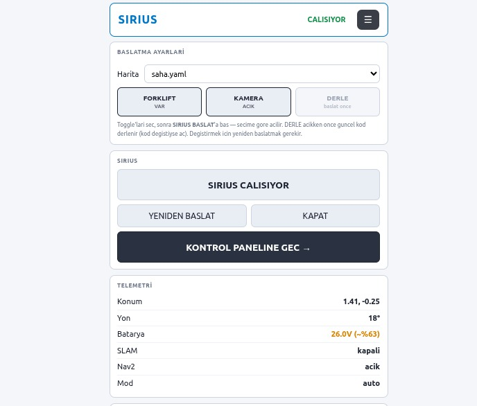
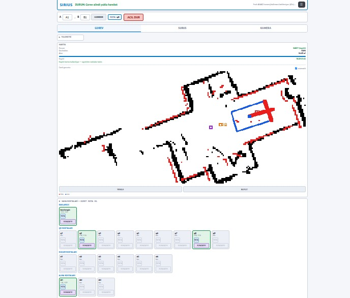
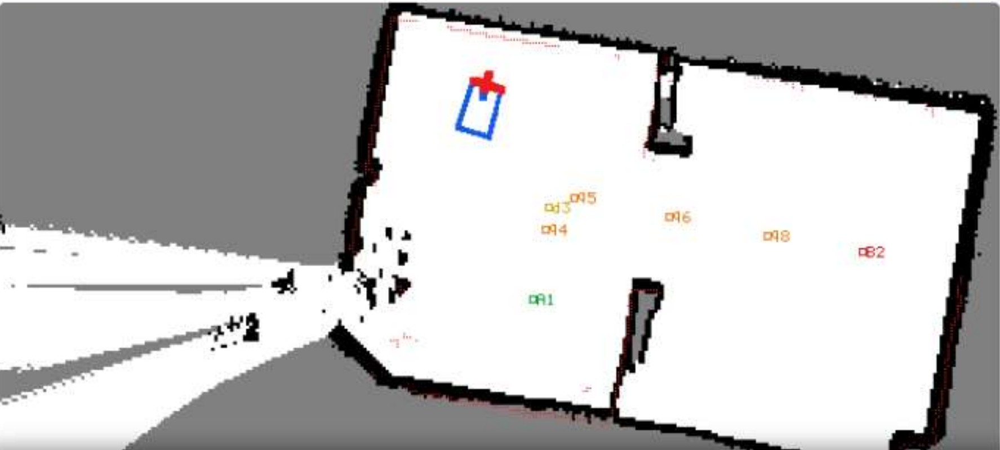

# SIRIUS Autonomous Mobile Forklift

**TEKNOFEST 2026 Sanayide Robotik Uygulamalar Yarışması · Türkiye 6'ncılığı**

SIRIUS, PUSULA takımı olarak fabrika ve depo ortamlarında otonom yük taşıma görevleri için geliştirdiğimiz mobil forklift projesidir. Projemizle TEKNOFEST 2026 Sanayide Robotik Uygulamalar Yarışması'nda **30 finalist takım arasından Türkiye 6'ncısı** olduk.

Araç; ortamın haritalanması, fabrika otomasyon sistemiyle haberleşme, otonom navigasyon, engel algılama, çizgi takibiyle hassas yanaşma ve yük taşıma görevlerini gerçekleştirmektedir.

## Demo

> Yarışma videosunu açmak için görsele tıklayın.

## Yarışma Görevleri

- LiDAR ile yarışma alanının haritalanması
- PLC/FMS üzerinden yük alma ve bırakma görevinin alınması
- Harita üzerinde konumlandırma ve rota planlama
- Otonom navigasyon ve engel algılama
- QR kod ve çizgi takibiyle yük noktasına hassas yanaşma
- Yükün alınması, belirlenen noktaya taşınması ve bırakılması
- Görev durumunun fabrika otomasyon sistemine bildirilmesi

## Projedeki Katkılarım

Projede yazılım ekibinde görev aldım. Başlıca sorumluluklarım:

- PLC/FMS ile araç arasındaki WebSocket ve JSON tabanlı haberleşmenin geliştirilmesi
- Görev paketlerinin doğrulanması ve ROS 2 görev yönetimine aktarılması
- Görev alındığında `ACK`, tamamlandığında `TASK_DONE` mesajlarının gönderilmesi
- Sensör ve araç durumlarının yazılım sistemine ve web arayüzüne aktarılması
- Web kontrol panelinin frontend ve backend geliştirmeleri
- Haberleşme ve arayüz entegrasyonunun saha testleri

## Yazılım Mimarisi

| Katman | Kullanılan teknoloji |
| --- | --- |
| Frontend | HTML, CSS, Vanilla JavaScript |
| Backend | Python, Flask |
| Robotik altyapı | ROS 2 Humble |
| Otonom navigasyon | Nav2 |
| Haritalama | SLAM Toolbox |
| Konum kestirimi | EKF, LiDAR, IMU ve enkoder verileri |
| Canlı veri aktarımı | ROSBridge WebSocket |
| PLC/FMS haberleşmesi | WebSocket, JSON |
| Komut gönderimi | REST API |
| Görselleştirme | Three.js, Chart.js |
| Ana bilgisayar | Jetson Nano 4 GB |

ROS 2, robot üzerindeki sensörlerin, görev yönetiminin ve hareket sistemlerinin birbiriyle haberleşmesini sağlayan robotik yazılım altyapısıdır. SIRIUS'ta haritalama, konumlandırma, rota planlama ve görev yürütme bileşenleri ROS 2 üzerinde birlikte çalışmaktadır.

## PLC/FMS Haberleşme Akışı

Fabrika otomasyon sistemi, görev kimliği ile yük alma ve bırakma noktalarını içeren paketi gönderir. Jetson Nano üzerindeki haberleşme katmanı paketi doğrular, görevi ROS 2'ye aktarır ve görev durumunu otomasyon sistemine geri bildirir.

## Web Kontrol Paneli

Web paneli üzerinden harita seçimi, sistem durumu, aracın anlık konumu, görev noktaları, manuel sürüş ve kamera görüntüsü takip edilebilmektedir.

| Başlangıç ve telemetri ekranı | Navigasyon ve görev ekranı |
| --- | --- |
|  |  |

## Donanım

- Jetson Nano 4 GB ana bilgisayar
- Arduino Mega 2560 ve ESP32 kontrol kartları
- LiDAR, IMU, enkoder ve kamera
- DC motorlar, motor sürücüleri ve kaldırma mekanizması
- 8S2P LiFePO4 batarya paketi ve 40 A BMS
- Acil durdurma ve temas tabanlı çarpışma algılama sistemi

## Takım

SIRIUS, Bursa Teknik Üniversitesi PUSULA takımının ortak çalışmasıyla geliştirilmiştir.

| Rol | Ekip üyeleri |
| --- | --- |
| Takım kaptanı | Mehmet Furkan Ketme |
| Yazılım | Furkan Karslı, Elif Beycan, Aslıhan Okumuş, Sude Çakmak |
| Elektronik | Yusuf Düzenli, Netice Arsan |
| Mekanik | Hasan Eren Yazıcı, Oğuzhan Dursun |
| Danışman | Oğuz Mısır |

## Not

Bu depo, SIRIUS projesini ve projedeki kişisel katkılarımı tanıtmak amacıyla hazırlanmıştır. Projenin kaynak kodları takımın ortak çalışma alanında tutulduğu için bu depoda paylaşılmamaktadır.

